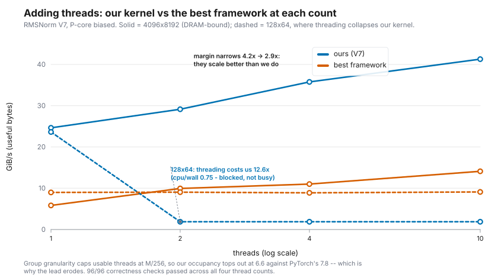

MLC-Norm Sprint 7.6: Threaded External Comparison
=================================================

Closing a gap this report named itself
----------------------------------------

Sprint 7.5 compared five implementations single-threaded and listed the missing
half in its own limits:

   **Threaded comparison.** Everything here is single-threaded; the frameworks
   parallelize by default and our TEIR path scales to 2.1×, so a multi-thread
   comparison is a separate question with a separate ceiling.

This sprint runs that comparison: the same five implementations, the same three
shapes, the same correctness gate, at 1, 2, 4 and 10 threads, biased onto the
performance cores.

The result is not a uniform win, and the two places we lose are the useful part.

Method
~~~~~~~~

Everything from the Sprint-7.5 method carries over — native layout for each
implementation, useful bytes (1R+1W), correctness gating before timing — with
three additions forced by threading.

**"Performance cores" is a request, not a setting.** This M4 reports
``hw.perflevel0.physicalcpu = 4`` (Performance) and
``hw.perflevel1.physicalcpu = 6`` (Efficiency). macOS exposes **no
thread-to-core pinning API** — ``THREAD_AFFINITY_POLICY`` is not supported on
Apple Silicon — so the only lever is Quality of Service, and it is asymmetric:

.. list-table::
   :header-rows: 1

   * - QoS class
     - What it actually gives you
   * - ``QOS_CLASS_USER_INTERACTIVE``
     - A *bias* toward the P cluster. Not a guarantee.
   * - ``QOS_CLASS_BACKGROUND``
     - Confinement to the E cluster. This direction *is* a guarantee.

So the P-core claim has to be tested rather than asserted, which is what the
control experiment below does.

**libomp workers do not inherit the main thread's QoS.** This was assumed and
turned out to be false. Probing ``qos_class_self()`` from inside a four-thread
parallel region entered from a ``USER_INTERACTIVE`` main thread:

.. code-block:: text

   worker 0: USER_INTERACTIVE     <- this is the main thread itself
   worker 1: DEFAULT
   worker 2: DEFAULT
   worker 3: DEFAULT

Setting QoS on the main thread alone therefore biases exactly one thread of
four. ``request_worker_core()`` is now called *inside* the parallel region, per
worker, and the section prints the QoS actually in effect so the claim is
checkable from the artifact.

.. note::

   The Sprint-6 full-chip scaling section deliberately keeps the old
   behaviour — workers at ``DEFAULT``. Biasing sixteen threads toward four
   P-cores would distort the very occupancy curve that section exists to show,
   so the P-core request is opt-in and this sprint is the only caller. The
   Sprint-6 numbers are therefore unchanged, which was verified by re-running
   it after the refactor: median drift 1.0 %, and the only cells moving more
   were near-zero percentages in the alignment-gain column.

**Occupancy is measured, not requested.** Every row carries CPU-seconds per
wall-second from ``getrusage``. This is the same instrument that caught the
ExecuTorch threadpool running ten workers while Sprint 7.5 described itself as
single-threaded, and the rule now applies to our own kernel as well: a row
claiming four threads whose occupancy reads 1.0 did not get them.

Correctness first
~~~~~~~~~~~~~~~~~~~

Threading is exactly the kind of change that can silently alter results, so the
gate runs per thread count rather than once — a different pool size can select a
different kernel, and a pass at one thread is not evidence for four.

**96 of 96 checks passed**: 12 per framework × 4 thread counts × 2 frameworks,
each verified against the float64 C++ reference before any throughput from that
run is quoted.

Results
~~~~~~~~~

   RMSNorm V7 against the strongest framework at each thread count. The solid
   pair is the DRAM shape, where our lead narrows as cores are added; the
   dashed pair is 128×64, where threading collapses our kernel and leaves the
   frameworks flat.

Best-of-N, with the **median in brackets**. Both are shown because on several
framework rows they disagree badly enough to change the conclusion — see
`Where best-of-N breaks down`_ below. The margin column is
ours/best-baseline, computed on best and on median respectively.

.. list-table:: RMSNorm — GiB/s, higher is better
   :header-rows: 1

   * - shape
     - thr
     - **ours (V7)**
     - torch eager
     - torch.compile
     - ET portable
     - ET XNNPACK
     - margin best/median
   * - 128×64
     - 1
     - **23.63** (23.63)
     - 8.99 (7.79)
     - 4.44 (4.30)
     - 2.50 (2.49)
     - 8.28 (7.96)
     - 2.63× / 2.97×
   * -
     - 2
     - 1.88 (1.87)
     - 9.04 (8.72)
     - 2.93 (2.78)
     - 2.56 (2.50)
     - 5.12 (4.65)
     - **0.21× / 0.21×**
   * -
     - 4
     - 1.88 (1.86)
     - 8.88 (8.64)
     - 2.25 (2.18)
     - 2.56 (2.53)
     - 5.55 (3.73)
     - **0.21× / 0.22×**
   * -
     - 10
     - 1.88 (1.87)
     - 9.10 (8.88)
     - 1.49 (1.34)
     - 2.56 (2.50)
     - 2.74 (1.02)
     - **0.21× / 0.21×**
   * - 1024×2048
     - 1
     - **38.46** (38.45)
     - 3.27 (2.97)
     - 6.53 (6.47)
     - 1.91 (1.90)
     - 4.44 (4.35)
     - 5.89× / 5.94×
   * -
     - 2
     - **51.24** (46.86)
     - 4.60 (3.53)
     - 10.58 (10.53)
     - 2.80 (2.78)
     - 6.88 (4.87)
     - 4.84× / 4.45×
   * -
     - 4
     - **53.48** (52.08)
     - 4.51 (3.49)
     - 17.72 (10.21)
     - 3.03 (3.02)
     - 4.95 (4.82)
     - 3.02× / 5.10×
   * -
     - 10
     - **52.80** (52.13)
     - 3.86 (3.27)
     - 10.17 (9.70)
     - 4.12 (3.42)
     - 4.79 (4.74)
     - 5.19× / 5.37×
   * - 4096×8192
     - 1
     - **24.64** (24.59)
     - 2.75 (2.71)
     - 5.83 (3.25)
     - 1.84 (1.84)
     - 4.11 (4.07)
     - 4.23× / 6.04×
   * -
     - 2
     - **29.14** (29.06)
     - 3.49 (3.41)
     - 9.94 (9.73)
     - 2.74 (2.71)
     - 4.79 (4.72)
     - 2.93× / 2.99×
   * -
     - 4
     - **35.76** (35.71)
     - 3.79 (3.54)
     - 11.00 (10.15)
     - 3.18 (3.05)
     - 4.74 (4.63)
     - 3.25× / 3.52×
   * -
     - 10
     - **41.28** (40.95)
     - 4.07 (3.53)
     - 14.10 (10.68)
     - 3.62 (3.49)
     - 5.39 (4.60)
     - 2.93× / 3.83×

.. list-table:: LayerNorm — GiB/s, higher is better
   :header-rows: 1

   * - shape
     - thr
     - **ours (V7)**
     - torch eager
     - torch.compile
     - ET portable
     - ET XNNPACK
     - margin best/median
   * - 128×64
     - 1
     - **11.81** (10.61)
     - 11.54 (11.27)
     - 3.95 (3.83)
     - 5.03 (4.97)
     - 5.07 (4.96)
     - 1.02× / 0.94×
   * -
     - 2
     - 1.82 (1.76)
     - 6.34 (5.89)
     - 1.79 (1.19)
     - 4.49 (4.41)
     - 5.09 (4.97)
     - **0.29× / 0.30×**
   * -
     - 4
     - 1.78 (1.76)
     - 4.25 (3.59)
     - 1.26 (1.10)
     - 4.48 (4.37)
     - 4.56 (4.45)
     - **0.39× / 0.40×**
   * -
     - 10
     - 1.78 (1.77)
     - 2.40 (1.74)
     - 0.62 (0.36)
     - 5.03 (4.85)
     - 4.93 (4.86)
     - **0.35× / 0.36×**
   * - 1024×2048
     - 1
     - **16.48** (16.33)
     - 7.82 (7.68)
     - 4.53 (4.49)
     - 6.24 (6.21)
     - 6.26 (6.01)
     - 2.11× / 2.13×
   * -
     - 2
     - 23.19 (23.08)
     - 26.80 (10.65)
     - 7.84 (7.79)
     - 11.99 (7.04)
     - 7.16 (6.98)
     - 0.87× / **2.17×**
   * -
     - 4
     - 24.83 (24.06)
     - 28.42 (11.03)
     - 9.47 (9.21)
     - 11.32 (6.72)
     - 6.84 (6.75)
     - 0.87× / **2.18×**
   * -
     - 10
     - **24.97** (24.19)
     - 20.04 (9.98)
     - 9.75 (9.36)
     - 12.81 (6.71)
     - 6.69 (6.61)
     - 1.25× / **2.42×**
   * - 4096×8192
     - 1
     - **13.56** (13.53)
     - 7.39 (7.23)
     - 4.41 (4.36)
     - 5.89 (5.77)
     - 5.94 (5.85)
     - 1.83× / 1.87×
   * -
     - 2
     - **18.14** (18.11)
     - 10.97 (10.59)
     - 7.58 (7.45)
     - 7.15 (6.87)
     - 7.16 (6.90)
     - 1.65× / 1.71×
   * -
     - 4
     - **22.75** (22.72)
     - 11.45 (10.74)
     - 10.47 (9.38)
     - 7.07 (6.78)
     - 7.16 (6.87)
     - 1.99× / 2.12×
   * -
     - 10
     - **25.37** (24.77)
     - 10.38 (5.03)
     - 15.55 (10.38)
     - 7.18 (6.82)
     - 7.36 (6.78)
     - 1.63× / 2.39×

Threading our kernel below ~1 MiB destroys it
~~~~~~~~~~~~~~~~~~~~~~~~~~~~~~~~~~~~~~~~~~~~~~

The single clearest result in this sprint, and it is against us. At 128×64
(32 KiB) our RMSNorm goes from **23.63 GiB/s on one thread to 1.88 on two** — a
12.6× loss — and the comparison flips from 2.63× ahead to 0.21×, five times
slower than the best framework. LayerNorm behaves the same way.

The occupancy column says what happened. Those rows measure **cpu/wall ≈ 0.75**,
*below* one: the threads are not competing for bandwidth, they are asleep. A
32 KiB tensor cannot amortize an OpenMP fork/join, so almost all of the wall
time is the barrier rather than the kernel. The frameworks degrade far more
gracefully here — torch eager's RMSNorm is essentially flat at ~9 GiB/s from 1
to 10 threads — because they do not distribute work this small in the first
place.

The actionable form: **our row-parallel decomposition needs a minimum size, and
does not currently have one.** A caller that threads unconditionally, which is
exactly what a naive TEIR integration would do, makes a 32 KiB norm twelve times
slower. Sprint 6 saw the same mechanism as a chunking cliff at awkward thread
counts; this is the same cost with no chunk large enough to hide it.

Group granularity caps our occupancy
~~~~~~~~~~~~~~~~~~~~~~~~~~~~~~~~~~~~~~

V6/V7 process 4·VL rows per group, and work is distributed in whole 256-row
blocks so that no thread is handed a predicated tail. 256 is a multiple of 4·VL
for every plausible SVL, which is what keeps the distribution vector-length
agnostic (decision D) — but it also means the number of *usable* threads is
``M / 256``, not the number of cores:

.. list-table::
   :header-rows: 1

   * - shape
     - group-aligned blocks
     - usable threads
     - our occupancy at "10 threads"
     - torch's
   * - 128×64
     - 2
     - 2
     - 0.76
     - 1.01
   * - 1024×2048
     - 4
     - 4
     - 3.21
     - 7.37
   * - 4096×8192
     - 16
     - 10
     - 6.56
     - 7.77

At 1024×2048 the "10 threads" row is really four, and the harness labels it as
such rather than reporting a thread count it did not use. This is a real
limitation of the decomposition, not a scheduling accident: dropping to 64-row
blocks would unlock more threads at SVL=512 and reintroduce the predicated tail
on any machine with a wider SVL, which is the trade decision D exists to avoid.

Our lead narrows as threads are added
~~~~~~~~~~~~~~~~~~~~~~~~~~~~~~~~~~~~~~~

At the DRAM shape our RMSNorm margin falls monotonically with thread count —
4.23× → 2.93× on best, 6.04× → 3.83× on median — and the reason is the row
above. ``torch.compile`` reaches an occupancy of 7.77 while we cap at 6.56, so
it converts extra cores into throughput faster than we do. We are still ahead by
roughly 3×, but the gap is a single-core-efficiency gap, and threading is
precisely the axis that erodes it.

LayerNorm is the mirror image: our margin at 4096×8192 *rises* on the median
comparison, 1.87× → 2.39×, because the fused ``native_layer_norm`` path that
made PyTorch competitive on one thread scales poorly past four.

.. _Where best-of-N breaks down:

Where best-of-N breaks down
~~~~~~~~~~~~~~~~~~~~~~~~~~~~~

The two cells where we lose LayerNorm at 1024×2048 are also the two least
trustworthy numbers in the table. PyTorch eager reports **best 28.42, median
11.03** there — the best sample is 2.6× the typical one, so it is a cache-lucky
outlier rather than a throughput the implementation sustains. Our own figures on
the same rows are 24.83 best against 24.06 median, a 3 % spread.

Both readings are given rather than choosing the flattering one. On best-vs-best
we lose those cells 0.87×; on median-vs-median we win them 2.18×. The honest
statement is that **at 1024×2048 LayerNorm the two are close enough that the
answer depends on which statistic you quote**, which is itself the finding.

Rows where best exceeded median by more than 1.5×, all of them framework rows:

.. list-table::
   :header-rows: 1

   * - implementation
     - shape
     - norm
     - thr
     - best
     - median
     - ratio
   * - ``et_xnnpack``
     - 128×64
     - rms
     - 10
     - 2.74
     - 1.02
     - 2.69×
   * - ``torch_eager``
     - 1024×2048
     - layer
     - 4
     - 28.42
     - 11.03
     - 2.58×
   * - ``torch_eager``
     - 1024×2048
     - layer
     - 2
     - 26.80
     - 10.65
     - 2.52×
   * - ``torch_eager``
     - 4096×8192
     - layer
     - 10
     - 10.38
     - 5.03
     - 2.06×
   * - ``et_portable``
     - 1024×2048
     - layer
     - 10
     - 12.81
     - 6.71
     - 1.91×

The P-core claim, tested
~~~~~~~~~~~~~~~~~~~~~~~~~~

Since QoS cannot pin, the label is verified by contrast: the identical kernel,
threads and data re-run at ``BACKGROUND``, which macOS *does* confine to the E
cluster. A ratio near 1.0× would mean the request changed nothing.

.. list-table:: RMSNorm V7, P-biased vs E-confined
   :header-rows: 1

   * - shape
     - threads
     - P-biased
     - background
     - ratio
   * - 1024×2048
     - 2
     - 47.93
     - 46.30
     - 1.04×
   * - 1024×2048
     - 4
     - 47.06
     - 32.82
     - **1.43×**
   * - 4096×8192
     - 2
     - 29.25
     - 17.62
     - **1.66×**
   * - 4096×8192
     - 4
     - 35.53
     - 22.92
     - **1.55×**

Three of the four differ by 43–66 %, so those runs demonstrably reached cores
the background run could not. The exception is informative rather than
awkward: at 1024×2048 on two threads the working set is largely cache-resident,
so the run is not bandwidth-bound and which cluster serves it barely matters.
The evidence supports "P-biased" where it is load-bearing — the DRAM-bound
rows — and does not overreach on the row where it is not.

ExecuTorch reliability, measured
~~~~~~~~~~~~~~~~~~~~~~~~~~~~~~~~~~

Sprint 7.5 recorded that ExecuTorch 1.4.1's XNNPACK RMSNorm at 1024×2048 fails
intermittently and estimated one run in three. Running it deliberately, 10
trials at each thread count with byte-identical inputs:

.. list-table:: RMSNorm / XNNPACK / 1024×2048, 10 trials each
   :header-rows: 1

   * - threads
     - succeeded
     - failure
   * - 1
     - 5 / 10
     - ``error: 0x23``
   * - 2
     - 6 / 10
     - ``error: 0x23``
   * - 4
     - 2 / 10
     - ``error: 0x23``
   * - 10
     - 7 / 10
     - ``error: 0x23``

**20 of 40 attempts failed** — the real rate is about one in two, not one in
three, and it does not depend on the thread count in any clean way. The failure
is preceded by ``[method.cpp:987] No chains``, i.e. the lowered program comes
out with nothing to execute; it is a non-determinism inside the library, not in
our harness or inputs.

A second, harder failure mode also appeared: ``[method_meta.cpp:53] Invalid
tag: 0 input idx: 0`` followed by ``CheckOk assert failed: hasValue_``, which
aborts the process rather than raising, so no in-process retry can catch it. It
killed one entire four-thread run, which had to be repeated at the shell level.

The driver now retries a failed lowering up to ten times and **prints how many
attempts a row needed**, so a number that took four tries is visible as such
rather than laundered into a clean-looking table.

Reproducing
~~~~~~~~~~~~~

.. code-block:: bash

   # our column
   cmake --preset release-submission && cmake --build build-submission -j
   ./build-submission/src/norm/main_norm      # section "SPRINT 7.6"

   # the frameworks, one run per thread count, then the gate
   for T in 1 2 4 10; do
     python bench/baselines/torch_norm_bench.py      --outdir /tmp/thr/torch_t$T --threads $T
     python bench/baselines/executorch_norm_bench.py --outdir /tmp/thr/et_t$T    --threads $T
     ./build/bench/verify_baseline /tmp/thr/torch_t$T
     ./build/bench/verify_baseline /tmp/thr/et_t$T
   done

Every manifest header records the requested thread count, the count the
framework actually adopted, and whether the P-core QoS request succeeded.

What this changes and what it leaves open
-------------------------------------------

**Settled.** The single-threaded margins were not an artifact of denying the
frameworks their parallelism: at the two larger shapes we stay ahead at every
thread count, by 2.9–5.9× on RMSNorm and 1.6–2.4× on LayerNorm.

**New and against us.** Our decomposition has no minimum problem size and is
catastrophic below ~1 MiB; and its 256-row granularity caps usable threads at
``M/256``, which costs real occupancy at 1024×2048 and is why our lead narrows
as cores are added.

**Still open.**

* **A minimum-size guard.** The fix is small — fall back to the direct call
  below a threshold — but the threshold should be measured across shapes, not
  guessed, and that is a sprint of its own.
* **Occupancy above 4 threads at mid shapes.** Requires either an SVL-aware
  block size or accepting the predicated tail; both are measurable, neither is
  measured here.
* **Still no specialist vendor baseline**, threaded or otherwise. Beating
  PyTorch and ExecuTorch with more cores is no more a state-of-the-art claim
  than beating them with one.
