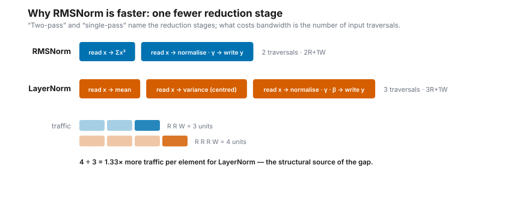
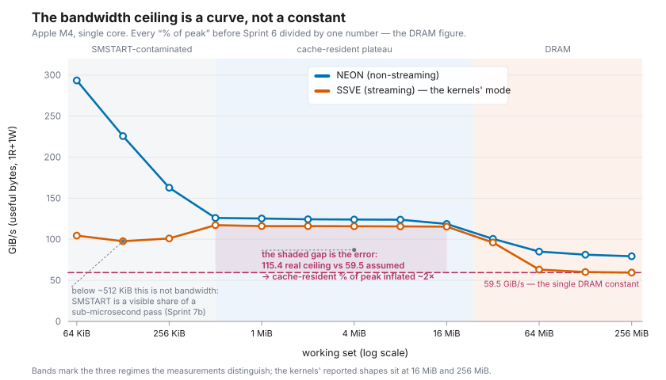
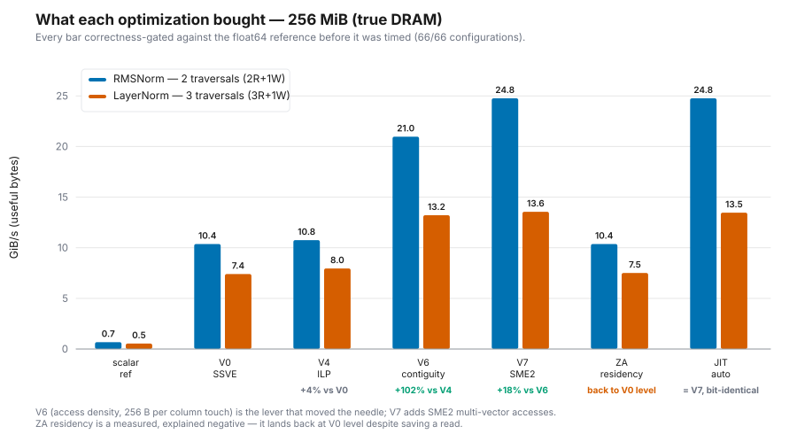
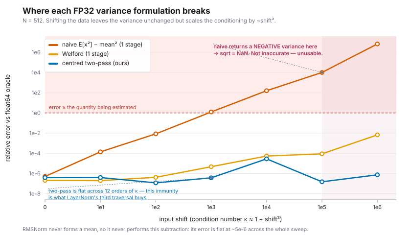
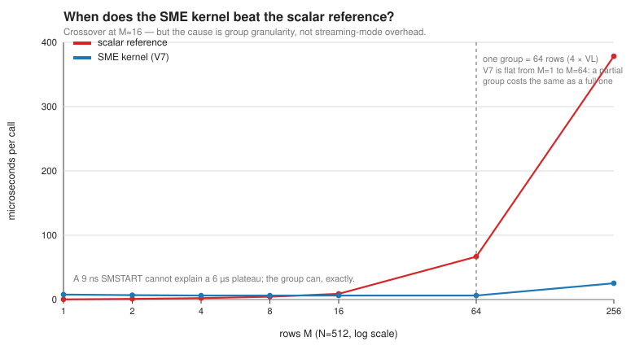
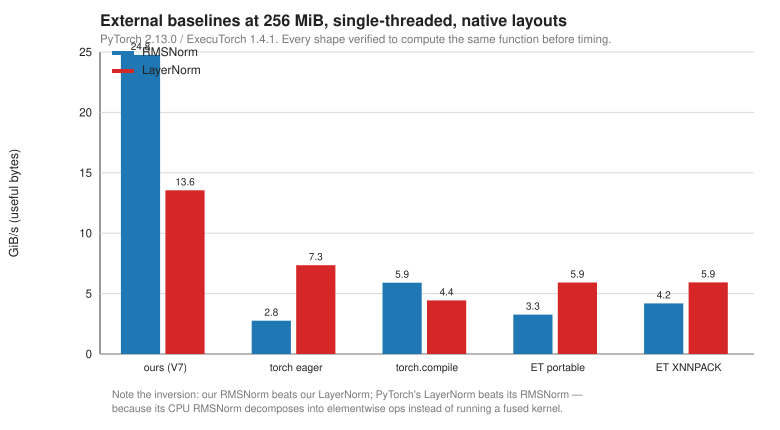

MLC-Norm — LayerNorm and RMSNorm on Apple SME
==============================================

.. admonition:: Draft status
   :class: warning

   This page is an **AI-assisted draft** prepared as a working document. Per
   the course's GenAI policy it is to be rewritten by the authors before
   submission; see :doc:`../genai`. The numbers, tables and figures are
   measured and traceable (see *Reproducibility*); the prose is a draft.

Research question
-----------------

Transformer normalization runs in every block, twice per layer, and touches
every element of the activation tensor while doing very little arithmetic per
element. It is therefore a **data-movement problem**. The question this project
asks is:

   *How close to the machine's achievable memory bandwidth can hand-written and
   JIT-generated SME/SSVE kernels bring LayerNorm and RMSNorm on Apple silicon,
   and what actually limits them?*

The second half matters more than the first. A GiB/s number is only meaningful
against a correctly chosen ceiling, and much of what this project learned came
from discovering that its own ceiling — and several of its own claims — were
wrong.

System and hardware
-------------------

Everything is measured on one machine: **Apple M4** (4 P-cores + 6 E-cores),
macOS 15.2, AppleClang 16.0.0, streaming vector length **512 bits** (16 FP32
lanes, queried at runtime via ``RDSVL``). The CPU reports both ``FEAT_SME`` and
``FEAT_SME2``.

.. note::

   The feature set is **detected, not assumed**. Earlier revisions of the
   project documents asserted "the M4 is SME1" for several sprints while the
   hardware reported ``FEAT_SME2: 1``. Every benchmark run now prints a
   provenance header — git commit, build type, compiler, OS, and the ``sysctl``
   feature values — so a number cannot be separated from the machine state that
   produced it.

The stack is built bottom-up from the lab's weekly work: AArch64 assembly →
NEON/SVE → SME microkernels → a JIT code generator (``mini_jit``) → the TEIR
tensor-expression runtime. The norms are the first *new primitive* added on top.

Algorithmic choices
-------------------

The two norms differ in **reduction structure**, and the project treats that as
a deliberate ablation axis rather than a flag. The distinction that matters for
performance is *reduction stages* versus *input traversals* — the common
shorthand "two-pass / single-pass" conflates them:

   LayerNorm needs two reduction stages, hence three traversals of the input;
   RMSNorm needs one, hence two. The 1.33× traffic ratio is structural.

* **LayerNorm** — :math:`y = \gamma(x-\mu)/\sqrt{\sigma^2+\varepsilon} + \beta`.
  Two reduction stages (mean, then variance from **centred** values) plus output
  generation → **three traversals**, 3R+1W.
* **RMSNorm** — :math:`y = \gamma x/\sqrt{\mathrm{mean}(x^2)+\varepsilon}`.
  One reduction stage plus output → **two traversals**, 2R+1W.

Three claims are kept separate throughout, because they are separate:
**semantics** (RMSNorm omits mean-centering, hence one fewer traversal);
**literature** (Zhang & Sennrich report comparable task performance with runtime
reductions of roughly 7–64 % across their experiments); and **our measurement**
(1.8–2.3× on the shapes evaluated here). Kernel numerical agreement is *not*
model accuracy: our tests show our RMSNorm matches an *RMSNorm reference*, which
says nothing about whether substituting one norm for the other preserves
accuracy in a network.

Performance methodology
-----------------------

Three rules, each adopted after a measurement error forced it.

**1. Correctness gates performance, per configuration.** No throughput figure is
produced for code that has not first matched the float64 reference *on that
exact shape*. The gate runs the function about to be timed, compares its full
output, and refuses to time it on disagreement. The current run reports
**66 / 66 configurations verified before timing**. For the external baselines,
6 checks per framework (both norms at three shapes) were gated the same way,
covering the eager PyTorch outputs and the delegated ExecuTorch outputs. The
harness now writes one manifest row per *implementation*, so ``torch.compile``
and the ExecuTorch portable path are gated separately as well; those figures
must be regenerated on the pinned environment before they are quoted.

**2. Bytes are counted one way, and moved bytes differ per norm.** All GiB/s
figures count **useful bytes** = 1 read + 1 write per element. Moved bytes are
1.5× that for RMSNorm and 2.0× for LayerNorm — the two must not be conflated,
which an earlier version of the benchmark header did.

**3. The ceiling is a curve, not a constant.** This is the project's largest
correction and it invalidated percentages across five report sections.

   Measured single-core bandwidth against working-set size, both execution
   modes. Until Sprint 6 every "% of peak" divided by the 59.5 GiB/s DRAM
   constant, including for cache-resident shapes whose real ceiling is
   ~115 GiB/s.

Consequences worth stating explicitly:

* A cache-resident kernel divided by the DRAM ceiling is credited for a
  constraint it never met. The most-quoted number in earlier drafts — RMSNorm V6
  at "~95 % of the moved-bytes roofline" — is really **~50 %**.
* Streaming mode costs ~25 % against NEON at DRAM but is nearly free in cache
  (0.93×), so "streaming is a structural handicap" is a DRAM-regime statement.
* Below ~512 KiB the SSVE figure stops being a bandwidth number at all: NEON
  climbs toward L1 speed while SSVE falls, because ``SMSTART`` becomes a visible
  share of a sub-microsecond pass.

Variants and ablation
---------------------

Both norms were taken through the same ladder, each rung verified and measured
on the same harness.

   The ablation in the true-DRAM regime, where the levers separate most clearly.

What each lever bought, and — as importantly — what it did not:

.. list-table::
   :header-rows: 1
   :widths: 16 84

   * - lever
     - verdict
   * - V1 arithmetic (``FRSQRTE`` + NR)
     - ≈0. Reciprocal-sqrt latency is off the critical path.
   * - V2 hoisted ``1/N``
     - ≈0 on RMSNorm, **+9–12 % on LayerNorm** — the one verdict that does not
       transfer, because LayerNorm has two per-block divisions at serialization
       points.
   * - V3 unrolling
     - ≈0. The out-of-order core already overlaps sequential loads.
   * - V4 accumulator ILP
     - **+27–33 %**. The single dependency chain *was* the bottleneck — which
       also explains why V3 alone did nothing.
   * - V5 load pipelining
     - ≈0 vs V4, as pre-registered. Register renaming already covers it.
   * - **V6 access density**
     - **+131 % (RMS) / +71 % (LN)** in the DRAM regime. Grouping four VL-row
       blocks makes each column touch 256 contiguous bytes. The winning lever.
   * - **V7 SME2 multi-vector**
     - **+17.2 % RMSNorm at DRAM**, +2.7 % LayerNorm, ≈0 cache-resident.
   * - ZA tile residency
     - **Loses**, by 39–68 %. Rebuilding it on SME2 multi-vector ``MOVA``
       improved the ZA variants by 62 % for RMSNorm and 114 % for LayerNorm,
       but neither surpassed the SSVE implementation.

Two results are worth more than the speed-ups.

**ZA is a measured, explained negative.** The ZA tile is a matrix accumulator;
using it as a residency buffer costs 2–3 ``mova`` operations per element to save
a memory read that, thanks to V6's grouping, was already cache-resident. The
hypothesis was written down before measuring and the outcome recorded rather
than discarded. When SME2 made ``mova`` 4× cheaper, ZA got much faster and still
lost — converting an extrapolation into a measurement.

**V7's mechanism is narrower than either hypothesis.** Two hypotheses predicted
opposite LayerNorm outcomes; LayerNorm's +2.7 % does not support a simple
proportional instruction-count explanation. A 2-vector control then showed the
gain *saturates* (4→2 loads captures 90 % of it), which also rules out a simple
monotonic memory-level-parallelism explanation. What the data supports is a
threshold effect on load-instruction count, in load-dominated loops, in the
latency-exposed regime; we do not claim to have identified the mechanism.

Correctness and numerical behaviour
-----------------------------------

The project claimed from the outset that single-pass variance is dangerous and
that LayerNorm's centred two-pass avoids it — but never implemented the
dangerous version, so the claim had no counterexample. Sprint 7 supplied one.

   FP32 relative error against a float64 oracle as the input is shifted.

* **Naive single-pass error tracks the condition number**, and past shift 1e4 it
  returns a **negative variance** — so a kernel built on it emits ``NaN``, not
  merely an inaccurate number. That is a qualitative failure, which is why
  stability is treated as part of correctness rather than a separate concern.
* **The centred two-pass stays below ~3e-5 relative error across the tested
  shift sweep**, i.e. it does not degrade with conditioning the way the naive
  estimator does. That is what LayerNorm's extra traversal buys.
* **RMSNorm stays below ~1.8e-5 across the sweep** — about 2300× better than
  LayerNorm at shift 1e5 — because it never forms a mean and so never performs the cancelling
  subtraction. Its stability is structural, and it is the same property that
  makes it faster. Its own limit is elsewhere: :math:`\sum x^2` overflows FP32
  at :math:`|x| \approx \sqrt{\mathrm{FLT\_MAX}/N}`.

A finding that refines the story: at high shift, LayerNorm's residual error is
**not** the variance at all — two-pass fixed that — but the FP32 representation
of :math:`(x-\mu)` in the output. V0 (exact ``FSQRT``) and V6 (``FRSQRTE`` + NR)
are indistinguishable there, which is the evidence: the sqrt arithmetic is not
the binding constraint. The ``FRSQRTE`` substitution costs ~24× accuracy only on
well-conditioned data.

Generation and integration
--------------------------

The kernels are **JIT-generated** at runtime by ``mini_jit::Norm`` and invoked
through the **TEIR** runtime, which is the point of the exercise: the kernel is
a leaf the compiler schedules, not a standalone program.

* **Verification by encoding diff.** The generator's buffer is compared
  word-by-word against the *linked* hand-written kernel read from its function
  address at runtime — 157/157 and 208/208 words identical (110/144 with SME2).
  The JIT inherits the trust of kernels that already passed the full suite.
* **Feature-dependent emission.** ``generate()`` takes an ``isa_t``: SME2 emits
  V7, otherwise V6.
* **Threading.** With ``is_parallel`` on the row axis, RMSNorm scales
  20.28 → 42.80 GiB/s (2.11×) and LayerNorm 13.26 → 25.80 (1.94×) against an
  86 GiB/s chip ceiling.

When the SME kernel is worth using
----------------------------------

   Crossover against the scalar reference at N=512.

The crossover is at **M ≈ 16 rows**, and the cause is *not* streaming-mode
overhead. A direct probe measures one ``smstart``/``smstop`` round trip at
**9.07 ns** — about a fifth of the ~46 ns per-call floor — and SM+ZA costs the
same as SM-only. What actually makes small calls expensive is **group
granularity**: V6/V7 process four VL-row blocks at a time (64 rows), and a
partially filled group costs the same as a full one. A 9 ns transition cannot
explain a 6 µs plateau; the group explains it exactly.

This also quantifies a design decision previously taken on intuition: one
streaming region per call rather than one per row saves 128 × 9.07 ns ≈ 1.16 µs
at M=128, about 22× the entire per-call floor. *"Streaming mode is expensive" is
true per row and false per call*, and only the second is what these kernels do.

External comparison
-------------------

   Single-threaded, each implementation in its native layout, every shape
   verified to compute the same function before timing.

Against **PyTorch 2.13.0** and **ExecuTorch 1.4.1** (including the XNNPACK
delegate), our kernels are **1.5–2.1× faster on LayerNorm** and **4.2–5.8× on
RMSNorm**. The asymmetry is not about our kernels: in our PyTorch 2.13.0
profiler trace on the M4, eager ``torch.nn.RMSNorm`` decomposes into multiple
ATen operations (``mul``, ``pow``, ``sum``, ``div_``), whereas
``torch.nn.LayerNorm`` uses the fused ``aten::native_layer_norm`` path. We did
not obtain equivalent partitioning evidence for ExecuTorch, so we make no claim
about what its delegate does internally.

That produces a clean inversion. *Our* RMSNorm is faster than our LayerNorm, as
the traffic ratio says it should be; *PyTorch's* LayerNorm is 2.7× faster than
its RMSNorm. A fused implementation of the expensive norm beats a decomposed
implementation of the cheap one — the clearest argument in this report for why
writing the kernel was worth doing.

External validation
-------------------

Every figure above comes from our own harness, which is a single-instrument
story. The Jena *Hello SME* M4 microbenchmarks characterize the same
architecture independently and agree wherever the two overlap: 512-bit SVL;
SSVE ``FMLA`` at 31 GFLOP/s against our independently measured **31.0 GFLOPS**;
and a sharp bandwidth reduction above ~8 MiB, which **corroborates the footprint
correction** — turning "our probe produced these numbers" into "our numbers
reproduce an independently observed architectural feature". Their finding that
SME2 four-register ``LD1W`` reaches ~925 GiB/s against ~376 for single-register
loads independently motivates V7 as a lever aimed at a documented feature.

Threats to validity
-------------------

* **One machine, one OS.** Every number is from a single M4 on macOS 15.2.
  Nothing here establishes behaviour on other SME implementations; the kernels
  are VLA precisely because SVL is not guaranteed to be 512 bits.
* **Best-case reporting, now bounded.** Headline GiB/s is a best-of-N minimum —
  a ceiling estimate, not a typical value. Median and p10–p90 are now reported
  alongside. For the medium and large headline shapes the median is generally
  close to the best case, so those figures are typical; the smallest tensors
  show visibly greater relative timing variability. That was an assumption
  until it was measured.
* **No specialist vendor baseline.** The largest gap. Apple's BNNS was
  investigated and produced no number: on macOS 15.2 its LayerNorm entry point
  is deprecated and could not be executed, and **the Accelerate/BNNS API
  available on that system does not expose a direct RMSNorm operation**. This
  report therefore makes **no claim** about how our kernels compare to a
  specialist vendor implementation, in either direction. Details in
  ``docs/dev-notes/tooling/bnns_investigation.md``.
* **Native-layout comparison answers one question, not two.** It answers *what
  each implementation achieves in its preferred representation*. It does **not**
  answer *what substituting our kernel into a framework's tensor layout would
  cost*, which would have to include boundary conversion.
* **Framework margins are version statements.** On the previous stack the same
  harness gave our RMSNorm margin as 8–13× instead of 4.2–5.8×. The kernels did
  not change; the baseline did. Versions are pinned and recorded.
* **ExecuTorch numbers include runtime dispatch**, honest for an on-device
  comparison but not a pure kernel number.
* **Single-threaded except where stated.** The frameworks parallelize by
  default; our threaded results are reported separately against a chip ceiling.
* **Group granularity distorts small shapes.** Below 64 rows the kernel does a
  full group's work regardless, so small-M figures reflect that, not bandwidth.

Reproducibility
---------------

.. code-block:: bash

   cmake --preset release-submission
   cmake --build build-submission -j
   ./build-submission/src/norm/main_norm     # prints its own provenance header

The captured output of the run behind every table and figure here is checked in
at ``_static/results/main_norm_submission.txt``; the figures regenerate with
``python3 docs/figures/make_figures.py`` (no third-party dependencies). External
baselines use the pinned environment in
``bench/baselines/requirements-baselines.txt``, with run manifests under
``bench/baselines/manifests/``.

Conclusion
----------

Both norms were taken from a scalar reference to JIT-generated SME kernels
invoked through a compiler runtime, verified at every step against a float64
oracle. The best kernels reach **~33 % of the footprint-matched ceiling on
useful bytes (~50 % on moved bytes)** at cache-resident shapes and **~42 %** at
DRAM, and beat two general-purpose frameworks by 1.5–5.8×.

The more useful outcomes are the negative and corrective ones: the ZA tile is
the wrong tool for this operator, and it took a measurement to say so; SME2
helps, but not for the reason predicted; the streaming transition is 9 ns, not
the dominant per-call cost; and the project's own roofline was mis-stated for
five sprints in a way that inflated its results by ~2×. Each is recorded with
the experiment that produced it.

Scope note: SME was course material; **SME2-specific multi-vector optimization
was not**, and was reached here by detecting the hardware's actual feature set
and then testing a hypothesis against it.

Appendices — development record
-------------------------------

The sprint-by-sprint chronology, the error logs and the debugging histories are
kept as appendices. They are the development record rather than the report: the
argument above is meant to stand without them, and they exist because a
corrected claim is worth more when the correction is visible.

.. toctree::
   :maxdepth: 1

   norm_sprint0_1
   norm_sprint2_rmsnorm
   norm_sprint2_layernorm
   norm_sprint3
   norm_sprint4
   norm_sprint5
   norm_sprint6
   norm_sprint7
   norm_sprint7_5
   norm_sprint8
   sprint2_debug_log
